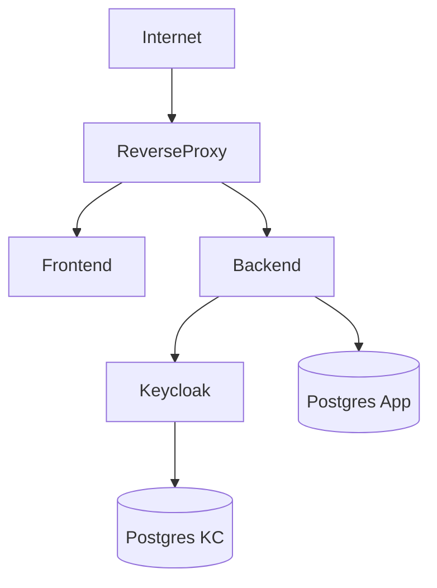

# ISO-27001-AUDIT — Enterprise-Grade Keycloak Architecture & Security Documentation

Author: Javid Shamsi  
Audience: Architecture Team / Security Team / DevOps / Audit  
Scope: Dev → Production Hardening Roadmap  
Version: 1.0

---

# 1. Executive Summary

This document describes the authentication and identity architecture for the ISO-27001-AUDIT platform using Keycloak.

The goal is to:

- Ensure secure authentication & authorization
- Prepare for SaaS multi-tenant architecture
- Be compliant-ready (ISO 27001 mindset)
- Define production hardening steps
- Provide threat modeling and mitigation strategies

---

# 2. High-Level Architecture

## Logical Architecture

```mermaid
flowchart LR
    User -->|Login| Frontend
    Frontend -->|OIDC Auth Code + PKCE| Keycloak
    Keycloak -->|JWT Access Token| Frontend
    Frontend -->|API Request + Bearer Token| Backend
    Backend -->|JWT Validation (JWKS)| Keycloak
    Backend --> Database
```

---

# 3. Deployment Architecture (Production)



Security Boundaries:

- Reverse Proxy (TLS termination)
- Internal Docker Network
- Separate DB per service
- No public exposure of management port

---

# 4. Authentication Strategy

## 4.1 Development Mode

Grant Type: Resource Owner Password (ONLY DEV)

Used for:
- Quick testing
- Local integration validation

Security Risk:
- Credentials handled by backend
- Not suitable for production

---

## 4.2 Production Mode (Required)

Grant Type: Authorization Code + PKCE

Why:
- Prevent credential exposure
- Prevent authorization code interception
- Align with OIDC Best Practices

Client Settings:

- publicClient = false
- client authentication = client secret
- standardFlowEnabled = true
- directAccessGrantsEnabled = false

---

# 5. Token Strategy

Access Token:
- Lifespan: 5–15 minutes

Refresh Token:
- Lifespan: 30–60 minutes
- Rotation enabled (recommended)

SSO Session Idle:
- 30–120 minutes

SSO Max:
- 8–24 hours

---

# 6. JWT Validation Strategy (Backend)

Backend MUST:

1. Validate signature via JWKS endpoint:
   /realms/{realm}/protocol/openid-connect/certs

2. Validate:
   - exp
   - iss
   - aud
   - azp

3. Reject token if:
   - expired
   - wrong issuer
   - wrong audience
   - revoked

---

# 7. Role-Based Access Control (RBAC)

## Design Options

### Option A — Realm Roles
Used for platform-level permissions.

### Option B — Client Roles
Used for API-specific permissions.

Recommended Structure:

- ADMIN
- AUDITOR
- OPERATOR
- VIEWER

Backend Enforcement:

- Read roles claim from JWT
- Map role → permission matrix
- Enforce at controller/service layer

---

# 8. Multi-Tenant Strategy (Future SaaS)

## Model 1 — Realm per Tenant

Pros:
- Strong isolation
- Clean separation

Cons:
- Operational overhead

## Model 2 — Single Realm + Tenant Claim

- Add org_id claim
- Enforce isolation at backend
- Use composite roles

Recommended for MVP: Model 2

---

# 9. Threat Model (STRIDE-Based)

## 9.1 Spoofing

Threat:
- Forged JWT

Mitigation:
- Signature validation
- Strict issuer check
- HTTPS only

---

## 9.2 Tampering

Threat:
- Token manipulation

Mitigation:
- JWT signature validation
- HMAC/RS256 verification

---

## 9.3 Repudiation

Threat:
- User denies action

Mitigation:
- Audit logs
- Event logging enabled in Keycloak
- Correlation ID per request

---

## 9.4 Information Disclosure

Threat:
- Token leakage

Mitigation:
- HTTPS only
- Short token lifetime
- No token logging
- Secure cookie flags

---

## 9.5 Denial of Service

Threat:
- Token endpoint abuse

Mitigation:
- Rate limiting at proxy
- Brute force protection enabled
- Fail2Ban (optional)

---

## 9.6 Elevation of Privilege

Threat:
- Role manipulation

Mitigation:
- Backend RBAC enforcement
- Never trust frontend role checks
- Validate role claim on every request

---

# 10. Security Hardening Checklist (Production)

- Disable password grant
- Enable PKCE
- Enable confidential client
- Rotate client secret
- Enable audit logging
- Enable brute force permanently
- Disable Keycloak dev mode
- Secure DB credentials in vault
- Enable HTTPS + HSTS
- Disable management port exposure
- Restrict container network access

---

# 11. Backup & Disaster Recovery

Keycloak DB:

- Daily Postgres dump
- Offsite encrypted backup
- Test restore quarterly

Application DB:

- Daily snapshot
- Transaction log retention

---

# 12. Monitoring & Observability

Required:

- Prometheus metrics
- Grafana dashboards
- Alerting on:
  - Keycloak down
  - Token errors spike
  - Brute force threshold reached

---

# 13. CI/CD Security Validation Pipeline

Pipeline should:

1. Start stack
2. Import realm
3. Health check validation
4. Token issuance test
5. JWT signature verification test
6. Protected endpoint authorization test

---

# 14. Production Readiness Scorecard

Dev Complete:
✔ Realm import  
✔ Token flow  
✔ Scope fix  
✔ Health checks  

Production Pending:
⬜ Authorization Code Flow  
⬜ PKCE  
⬜ Confidential client  
⬜ Backend JWT validation  
⬜ Role enforcement  
⬜ Monitoring  
⬜ Backup automation  

---

# 15. Conclusion

The system is development-ready and structurally aligned with secure architecture principles.

To become enterprise-ready:

- Replace password grant
- Enforce JWT validation strictly
- Implement RBAC properly
- Add monitoring & backup strategy
- Harden deployment layer

This document can be attached to:

- Jira Epic
- Security Review
- ISO 27001 internal audit preparation
- Architecture Board presentation

